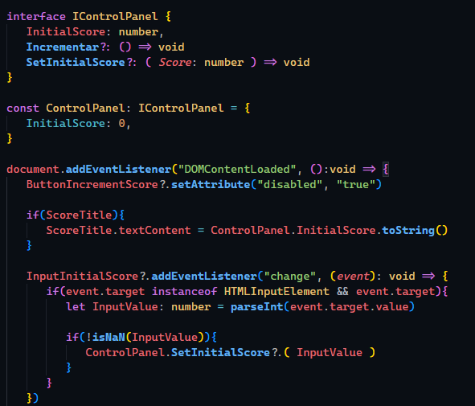
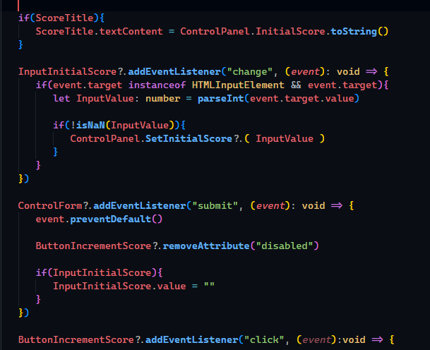

# Test de conocimiento

- Debes Realizar la funcionalidades de Establecer Puntuación Inicial
- Debes Realizar la funcionalidades de Incremento
- Limpiar el Input al establecer la puntuación

|      Función     | Parametro |  Tipo  |          Descripción        |
|:----------------:|:---------:|:------:|:---------------------------:|
|    Incrementar   |   empty   |  null  | Incrementar Contador        |
|  SetInitialScore |   Score   | number | Establer el contador inicial|

## Establece tus observaciones aquí

---

- Última Actualización: 1 agosto 2024
